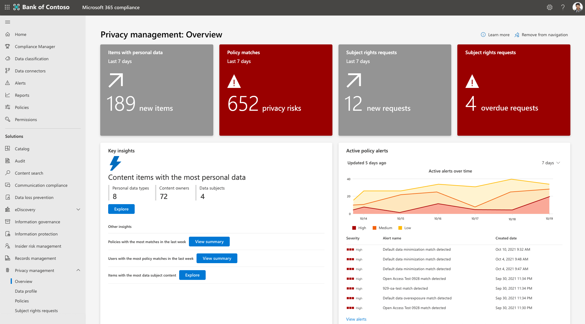

# 在 Microsoft Priva 中查找和可视化个人数据

Microsoft Priva 通过自动发现个人数据资产并提供基本信息的可视化效果来帮助你了解组织存储的数据。 可以在 **概述** 和 **数据配置文件** 页上找到这些可视化效果。 你可以利用此处的见解来加强组织的隐私状况并降低风险。

若要开始，请转到 [Microsoft Purview 合规性门户](https://compliance.microsoft.com/) 的 Priva 部分并查看以下页面：

- **概述**：在Microsoft 365中提供组织数据的总体视图。 隐私管理员可以监视趋势和活动，识别和调查涉及个人数据的潜在风险，以及跳板到策略管理或主体权利请求操作等关键活动中。
- **数据配置文件**：提供组织在Microsoft 365中存储的个人数据的快照。 此页面可帮助你直观显示个人数据的居住位置、组织中最普遍的类型，以及Microsoft 365环境中各个位置存在多少种不同的类型。 还可以从此位置浏览个人数据。

随着数据的变化和 Priva 做出新的发现，这些页面上显示的信息将会更新。 请注意，在图表中表示新数据可能需要长达 24 小时的时间。

## 浏览概述页

概述页由三个主要部分组成。 页面顶部的磁贴提供有关数据的基本最近统计信息。 关键见解部分提供对主要兴趣趋势和领域的调查机会。 若要进一步了解数据环境，请参阅趋势线图。 若要详细了解这些领域，请参阅以下部分。

### 顶部磁贴

#### 过去 7 天的策略匹配

在 Priva 隐私风险管理中设置策略时，将根据策略评估可能存在隐私风险的某些条件。 策略匹配项指示可能需要进一步审查或修正的数据发现。 此磁贴显示在过去七天内发生了多少个策略匹配项。 无论策略是在测试模式下还是在测试模式下运行，都会在此处显示匹配项，因此可以看到所有活动策略的结果。 选择此磁贴将转到隐私风险管理的“ **策略** ”页的筛选视图，其中显示了在过去七天内发生匹配的策略。

#### 包含个人数据的项目

若要查看 Priva 在工作中的自动发现功能，请查看 **具有个人数据磁贴的项** 。 此磁贴显示在过去七天中，组织Microsoft 365环境中发现了多少个包含基于设置的个人数据的新项。 选择此磁贴将加载发现的最新 100 个项目的视图。

#### 使用者权限请求

概述页包含一个磁贴，该磁贴显示在过去七天内创建了多少个主题权限请求。 第二个磁贴（如果适用）显示根据指定的截止时间逾期的请求数，可能需要立即关注。 选择这些磁贴会使具有相应权限的用户能够访问 Priva 的主题权限请求页。

### 关键见解

#### 包含最个人数据的内容项

包含大量个人数据的内容可能会带来更高的曝光风险。 你可能希望查看此类项目，以确保隐私风险管理策略涵盖这些项目。 为了帮助你注意这些项目，概述页面根据设置提供包含最个人数据的内容项的视图。 可在此处查看检测到的唯一个人数据类型的数量、已标识的唯一内容所有者的数量，以及根据主题权限请求的数据匹配设置标识了多少个数据主体。

为找到的项的摘要视图选择 **“视图摘要** ”。 还可以选择 **浏览** 这些发现以预览单个文件。 此视图最多显示 100 个项目。 隐私管理角色组中的用户可以选择文件以查看详细信息并确定相关性，并以.csv格式导出列表以供参考。

#### 上周匹配最多的策略

此见解展示了过去七天内最频繁匹配的策略，无论是在“打开”模式还是“测试”模式下。 当 Priva 用户优化其隐私行为时，它有助于说明策略的性能和正在进行的工作的影响。

选择 **视图摘要** ，以获取匹配的前 10 个策略和关联内容的内容所有者的摘要。 你还将看到由于这些策略匹配而发送了多少个用户通知，以及所执行的用户操作数。 选择 **“调查** ”以查看隐私风险管理中的“策略”页，该页面经过筛选以显示摘要视图中的策略。 此调查视图将显示策略的完整生存期的统计信息。 选择它可查看详细信息，例如最初检测到匹配项时。

#### 上周策略匹配最多的用户

此见解还解决了“测试”或“打开”模式下策略中的匹配项。 它允许你查看过去一周策略匹配最多的用户的摘要，以及它们匹配的策略。 这包括唯一内容所有者的总数、发送给这些用户的通知以及从这些通知中执行的操作数。 选择 **“调查** ”将转到“策略”页，该页面经过筛选以显示摘要视图中的策略。 在调查视图中，不会找到用户信息，但可以选择一个策略来查看与这些匹配项相关的策略详细信息。

#### 数据主体内容最多的项

此见解引用主题权限请求中数据匹配功能中的信息，并显示在包含最多数据主体的Microsoft 365中发现的内容项。 若要了解有关该设置的详细信息，请 [参阅了解主题权限请求](subject-rights-requests.md)。

这些项目有助于确认数据匹配配置，并有助于缓解与这些项目相关的隐私风险。 选择 **摘要视图的“视图摘要** ”。 选择 **“浏览”** 以查看其中多达 100 个项目的详细视图。 可在此处预览这些项并确定相关性，并以.csv格式导出列表。

### 趋势线图

有关在组织数据中找到的趋势的动态可视化效果，请参阅趋势线图。 这些图形可以按时间跨度、数据类型或数据位置等特征进行筛选。 使用提供的下拉列表调整视图。 将鼠标悬停在图形中的行上可以查看与该特定时间点相关的统计信息。

与策略相关的结果将包括“测试”和“打开”模式下策略中的数据。 如果没有特定类型的策略处于活动状态，相关图形将不显示任何结果。

#### 活动策略警报

此区域显示策略匹配触发的活动警报的快照。 随着时间的推移，此视图可以帮助你更轻松地检测异常，例如卷中的较大峰值。 选择 **“查看警报** ”以导航到隐私风险管理中的策略页，可在其中进一步调查警报并创建修正问题。

#### 在组织中找到的个人数据

此图显示了在Microsoft 365环境中发现与设置匹配的个人数据量及其所在位置的趋势。 在 Priva 运行了足够时间之后，在SharePoint、OneDrive、Teams和/或Exchange中找到包含个人数据的内容后，它将开始填充。

#### 组织中检测到的数据传输

此图与数据传输策略相关。 它提供了一个视图，了解数据在组织内（部门之间或多地理区域组织区域之间）的移动方式。

#### 未使用的个人数据

此图与数据最小化策略相关。 它提供有关组织如何存储包含个人数据的内容的见解，以及策略如何随着时间的推移改进对此数据的处理。

#### 过度表达的个人数据

此图与数据过度表达策略相关。 它可以帮助你识别组织内随时间推移的共享行为以及个人数据内容可能过度表达的位置，例如公开共享、与外部用户共享或在组织内广泛共享。

#### 按法规提出的主体权利请求

此视图提供有关一段时间内最普遍地推动使用者权利请求的法规的见解。 此图的图例显示了趋势法规的名称。 将鼠标悬停在趋势线上将显示在所选时间内为该法规打开的主体权限请求总数。

#### 按状态的使用者权限请求

此图显示组织如何完成主题权限请求，这些请求分为 **活动**、 **已关闭** 或 **过期** 的请求。 此处的发现可能有助于说明在何处可以从分配更多资源来关闭请求和满足目标中获益。

### 其他数据视图

#### 使用者权限请求一目了然

此视图提供活动主体权限请求的高级别视图，包括在截止时间之前完成请求的剩余时间。 它汇总了你拥有的请求总数、活动请求数以及已关闭的请求数。 选择 **“查看所有请求** ”，转到“主题权限请求”页，可在其中查看更多详细信息，并处理活动请求以将其进度到完成。

#### 按驻留方式提出的使用者权利请求

此地图视图可帮助你通过数据主体的驻留来可视化主体权限请求的数量。 将鼠标悬停在气泡上将标识该区域以及代表该地区居民提出的主体权利请求总数。

## 浏览数据配置文件页

Priva 中的数据配置文件页提供了组织存储在Microsoft 365及其所在位置的个人数据的快照视图。 它还可深入了解存储的数据类型。 主磁贴包括以下内容。

### 在Microsoft 365中检测到的个人数据类型实例

此磁贴可帮助你根据设置可视化Microsoft 365环境中存在多少个人数据，以及如何跨Exchange、OneDrive、SharePoint和Teams分布数据。

条形图显示内容中找到的唯一个人数据类型实例的大致聚合计数。 数据类型的示例可能包括信用卡号和社会保险号码等。 因此，发现的文件包含三个信用卡号和一个社保号码将包含两个唯一的个人数据类型和四个实例。 此磁贴的下半部分显示每个Microsoft 365位置中的唯一个人数据类型。 它提供了有关组织内容中检测到的个人数据类型的多样性的视图。

### 整个组织中的热门个人数据类型

此磁贴提供环境中检测到的顶级个人数据类型的快照，以及有关有多少项包含该个人数据类型以及在哪些位置的信息。

### 按区域分列的个人数据类型实例

对于多地理位置环境，此磁贴会根据托管此内容的区域在区域性地聚合内容中找到的个人数据类型实例。 对于单区域组织，此磁贴将显示一个表示Microsoft 365位置的点。 将鼠标悬停在地图上的点上将显示在该区域中发现的个人数据类型实例的大致计数。

### 浏览内容

在任何数据配置文件磁贴上选择 **“浏览** ”将打开内容资源管理器。 此时，无法搜索特定内容项，在此视图中将看不到Teams数据。 这意味着内容资源管理器中的数字可能与数据配置文件页上显示的数字不匹配，因为数据配置文件页确实包含Teams内容。 希望进一步深入了解其隐私数据的隐私管理员可在此处根据个人数据类型 (敏感信息类型) 或按位置 (Exchange、OneDrive或SharePoint) 执行此操作。

## 法律免责声明

[Microsoft Priva 法律免责声明](priva-disclaimer.md)
