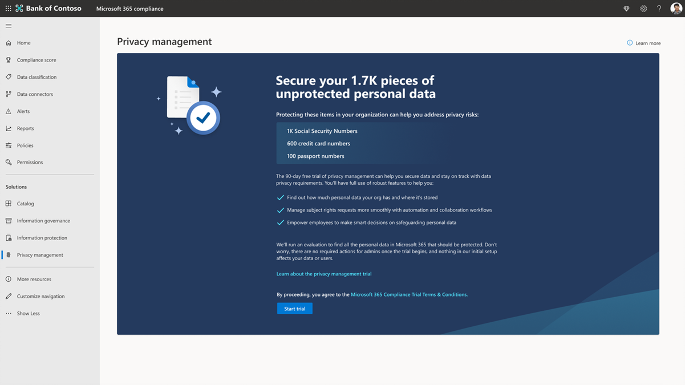

# 试用版 playbook：Microsoft Priva

欢迎使用Microsoft Priva试用 playbook。

此 playbook 将帮助你充分利用 90 天的免费试用版，帮助你保护个人数据并构建一个隐私可复原的工作场所。

使用 Microsoft 建议，你将了解Priva如何帮助你主动识别和防范隐私风险，如数据囤积、数据传输和数据过度共享，帮助组织大规模自动执行和管理主题请求，并使员工能够做出智能数据处理决策。

## 入门

*这些操作是有关要在 90 天的试用版中尝试的关键功能的建议。*

通过设置先决条件"开始"菜单试用版。 请注意，Priva由两个关键解决方案（Priva 隐私风险管理和Priva 主体权利请求）组成，可以单独试用和购买。 有关许可和购买详细信息，请参阅 [Microsoft.com](https://www.microsoft.com/security/business/privacy/privacy-management-software?rtc=1#office-ContentAreaHeadingTemplate-8x0pmkp)。

### 隐私风险管理

借助 **隐私风险管理** 解决方案，可以探索如何保护组织的个人数据并构建隐私可复原的工作区。

- 主动识别和防范隐私风险，例如数据囤积、数据传输和数据过度共享
- 了解个人数据的存储和移动
- 使信息工作者能够就处理此数据做出明智的决策
- 使用户能够有效地管理数据并采取措施遵守不断发展的隐私法规

### 使用者权限请求

使用 **“使用者权限请求** ”解决方案，可以了解如何处理从初始请求到生成报表的查询。

- 大规模管理使用者权限请求

## "开始"菜单Microsoft Priva试用版

如果已准备好开始使用Microsoft Priva，请按照以下步骤设置先决条件并开始探索隐私见解。

1. [确认订阅和许可](priva-setup.md#confirm-subscriptions-and-licensing)
1. [设置用户权限并分配角色](priva-setup.md#set-user-permissions-and-assign-roles)
1. 选择“"开始"菜单试用版”，将针对你执行以下操作：
    - Priva (实时启用试用许可证) 
    - 隐私见解生成 (这需要 24 小时) 

## "开始"菜单查找和可视化隐私风险

Priva通过自动发现个人数据资产并提供基本信息的可视化效果来帮助你了解组织存储的数据。

若要开始，请转到Microsoft Purview 合规门户的[Priva](https://compliance.microsoft.com/)部分并查看以下页面：

1. [概述](priva-data-profile.md#explore-the-overview-page)：提供隐私状况的聚合视图，包括Microsoft 365环境中个人数据的卷、类别、位置和移动。 此外，还可以了解个人数据过度共享、传输或未使用所产生的相关隐私风险的当前状态和趋势。
1. [数据配置文件](priva-data-profile.md#explore-the-data-profile-page)：提供组织在Microsoft 365中存储的个人数据的快照，包括卷、类型和位置 (存储和地理) 。

## 了解策略

隐私风险管理使你能够设置策略，识别Microsoft 365环境中的隐私风险，并启用简单的补救措施。

1. [了解关键风险方案](risk-management.md#learn-about-key-risk-scenarios)
1. [限制数据过度表达](risk-management.md#limit-data-overexposure)
1. [查找和缓解数据传输](risk-management.md#find-and-mitigate-data-transfers)
1. [最小化存储的数据](risk-management.md#minimize-stored-data)

## 创建和自定义策略

在隐私风险管理中创建新策略，以解决对组织至关重要的隐私风险方案。 若要快速入门，请使用模板默认设置为数据过度表达、数据传输以及数据最小化和方案创建新策略。

1. [使用具有默认设置的模板创建策略](risk-management-policies.md#quick-setup-using-a-template-with-default-settings)
1. [通过自定义模板设置创建策略](risk-management-policies.md#custom-setup-guided-process-to-choose-all-settings)
1. [了解所有策略的关键设置](risk-management-policies.md)
1. [了解数据最小化策略的设置](risk-management-policy-data-minimization.md)
1. [了解数据传输策略的设置](risk-management-policy-data-transfer.md)
1. [了解数据过度表达策略的设置](risk-management-policy-data-overexposure.md)

## 管理策略

在隐私风险管理中创建策略以处理数据最小化、数据传输或数据过度表达方案后，可能需要查看或更新策略设置。 你可能还希望在完全推出新策略以供持续使用之前测试新策略。

1. [查看策略详细信息](risk-management-policies-manage.md#view-details-and-activity-from-the-policy-details-page)
1. [测试策略](risk-management-policies-manage.md#testing-a-policy)
1. [删除策略](risk-management-policies-manage.md#delete-a-policy)

## 了解策略警报和问题

通过查看警报，可以识别需要跟进的情况。 为此，可以创建问题，为用户提供一种结构化的方式来查看内容、分配问题的严重性，并协作解决问题。

1. [查看当前警报和问题](risk-management-alerts.md#view-current-alerts-and-issues)
1. [管理警报](risk-management-alerts.md#manage-alerts)
1. [管理问题](risk-management-alerts.md#manage-issues)
1. [查看内容并修正问题](risk-management-alerts.md#review-content-and-remediate-issues)

## 发送用户策略通知

隐私风险管理可以直接通知内容所有者有关数据过度表达、数据最小化和数据传输策略匹配的信息。 通过电子邮件通知，用户可以轻松地了解他们需要查看的内容。

1. [为策略通知准备训练内容](risk-management-notifications.md#prepare-training-content-for-notifications)
1. [设置策略的电子邮件通知](risk-management-notifications.md#set-user-email-notifications)
1. [预览和自定义电子邮件通知](risk-management-notifications.md#preview-and-customize-email-content)
1. [在Teams中发送通知](risk-management-notifications.md#send-notifications-in-teams)

## 了解有关主体权限请求的信息

根据世界各地的某些隐私法规，个人 (或数据主体) 可以请求审查或管理公司收集的有关自己的个人数据。 这些请求有时也称为数据主体请求 （DSR）、数据主体访问请求 （DSAR） 或使用者权限请求。 Priva 主体权利请求可以帮助你处理这些查询。

1. [创建请求并收集数据](subject-rights-requests-create.md)
1. [数据匹配](subject-rights-requests-data-match.md)
1. [查看数据并协作处理请求](subject-rights-requests-data-review.md)
1. [满足请求](subject-rights-requests-reports.md)
1. [自动执行任务](subject-rights-requests-automate.md)

## 创建主体权限请求

使用者权限管理管理员可以通过主“主题权限请求”页打开新的主题权限请求。 向导将指导你完成查找有关数据主体的个人数据并开始完成其请求的过程的过程。

1. [使用使用者权限请求向导](subject-rights-requests-create.md#use-the-subject-rights-request-creation-wizard) - 创建请求
1. [定义搜索设置](subject-rights-requests-create.md#define-search-settings)
1. [优化搜索设置](subject-rights-requests-create.md#refine-your-search)

## 管理使用者权限请求的数据匹配

通过数据匹配，组织可以启用Priva根据确切提供的数据值来标识数据主体。

1. [准备数据导入](subject-rights-requests-data-match.md#prepare-for-data-import)
1. [定义个人数据架构](subject-rights-requests-data-match.md#define-the-personal-data-schema)
1. [Upload个人数据](subject-rights-requests-data-match.md#upload-personal-data)

## 查看数据并协作处理主体权限请求

创建主题权限请求后，Priva将使用有关主题的输入在组织的Microsoft 365环境中查找匹配项。 编译此数据后，可以查看调查结果，选择要包含的内容，并根据需要修改信息。

1. [查看请求详细信息并监视进度](subject-rights-requests-data-review.md#step-1-review-request-details-and-monitor-progress)
1. [查看和编辑搜索查询](subject-rights-requests-data-review.md#step-2-optional-view-and-edit-search-queries)  (可选) 
1. [查看数据](subject-rights-requests-data-review.md#step-3-review-data)
1. [关闭请求](subject-rights-requests-data-review.md#step-4-close-the-request)

## 管理主体权限请求报告和满足请求

完成主题权限请求的数据评审后，可以继续请求履行。

1. [为数据主题准备最终报表](subject-rights-requests-reports.md)
1. [通过 Microsoft 图形 API 和 Power Automate 集成和扩展](subject-rights-requests-automate.md)
1. [管理数据保留](subject-rights-requests-reports.md#retention-periods-for-reports-and-data)

## 使用Power Automate扩展

为Priva启用Power Automate流，以便自动执行事例和用户的重要任务，例如在 ServiceNow 中创建票证或添加有关截止日期的日历提醒。

1. [从模板创建新的Power Automate流](subject-rights-requests-automate.md#create-a-new-power-automate-flow-from-a-template)
1. [共享Power Automate流](subject-rights-requests-automate.md#share-a-power-automate-flow)
1. [编辑或删除Power Automate流](subject-rights-requests-automate.md#edit-or-delete-power-automate-flow)

## 其他资源

**Microsoft Docs**：获取有关Microsoft Priva的工作原理以及如何为组织最好地实现它的详细信息。 [访问文档](priva-overview.md)。

**为何Microsoft Priva**：详细了解此 [视频中](https://www.youtube.com/watch?v=6OLky1biPIQ)的Priva功能。

**在此处详细了解Microsoft Priva**：博客、计划 [和定价。](https://aka.ms/privacymgmt/web)

**购买Microsoft Priva**：隐私风险管理和使用者权利请求单独出售。 有关许可和购买详细信息，请参阅 [Microsoft.com](https://www.microsoft.com/en-us/security/business/privacy/privacy-management-software?rtc=1#office-ContentAreaHeadingTemplate-8x0pmkp)。
